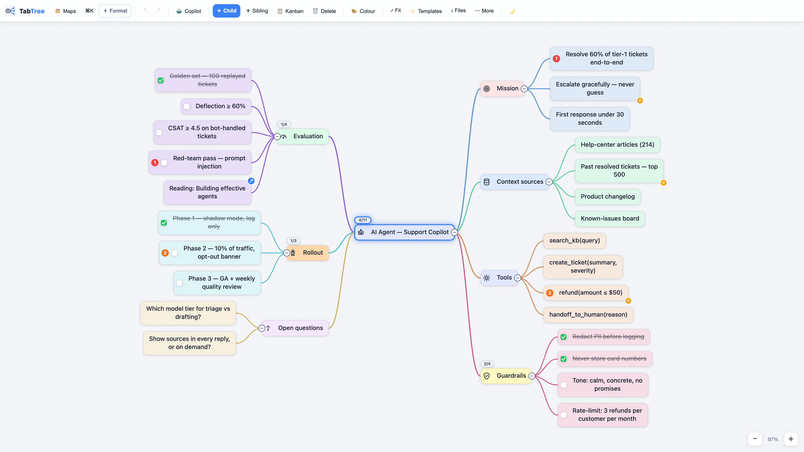
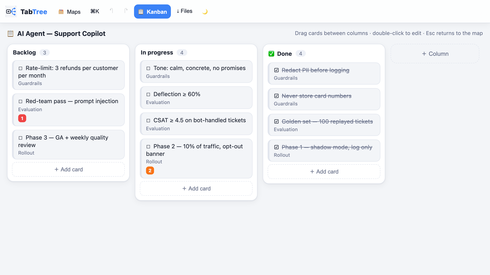
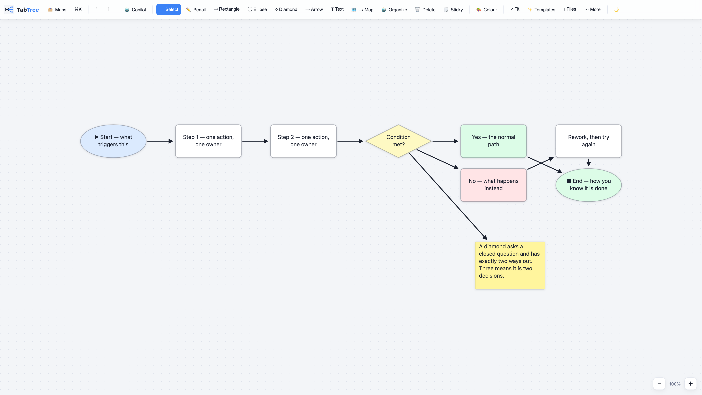
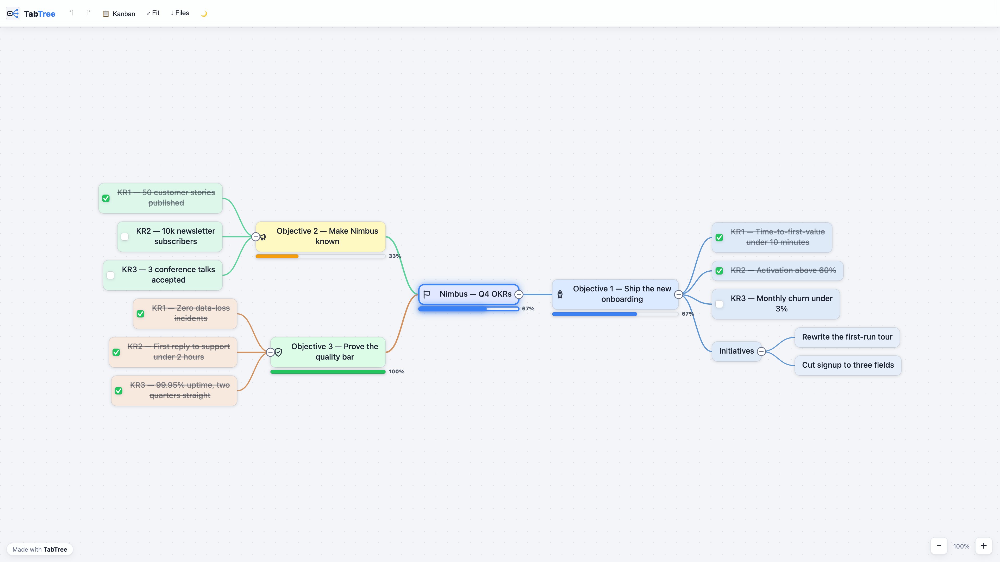
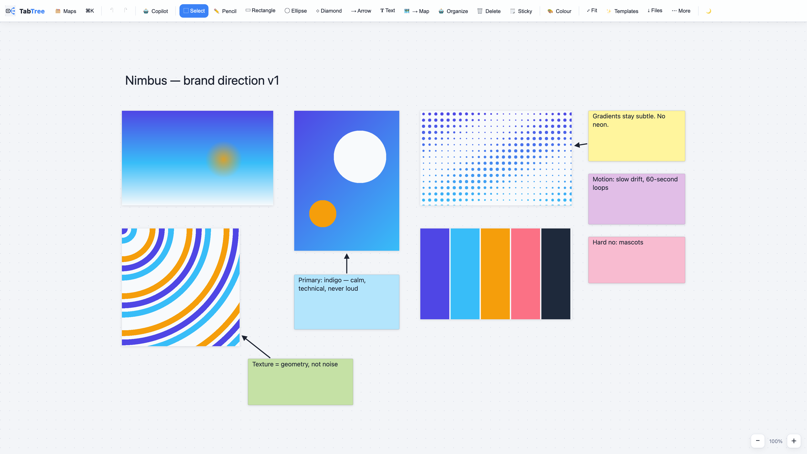
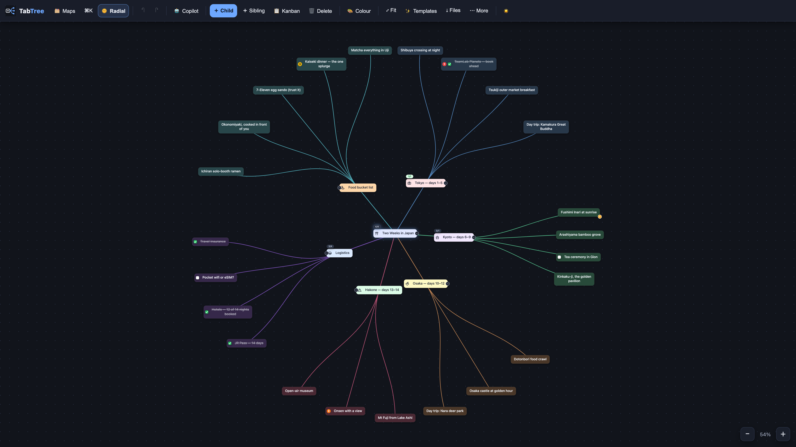

# TabTree

**Mind maps and whiteboards in one offline HTML file.**

[Live demo — no signup](https://tabtree.app/tabtree-demo.html?embed=1) · [tabtree.app](https://tabtree.app) · [Templates](templates/) · [Claude connector](#claude-connector)



---

## What it is

TabTree is a mind-mapping and whiteboard app that fits in **a single HTML file**.
You double-click it and it runs — offline, with no account, no server and no
subscription. One document reads six ways: mind map, kanban board, Gantt chart,
page of notes, spreadsheet or full-screen presentation. Switch views; nothing is
converted and nothing is lost.

| | |
|---|---|
| **One file** | The entire app is one HTML file — no install, no build, no dependencies. |
| **Offline, always** | It runs from `file://`. Nothing leaves your machine. |
| **Bought once** | No subscription, no account, no telemetry, no expiry. |
| **69 templates** | Business Model Canvas, Lean Canvas, OKRs, roadmaps, agent specs… [all of them](templates/) |
| **It leaves the building** | PNG posts, carousel PDFs, MP4 flythroughs, or one `.html` file that carries the app and the map together. |
| **Claude writes into it** | The connector below is free with every licence. |

## This repository

TabTree itself is a commercial product and its source is not published here.
**This repository is the public face of it**, and it holds three things that are
genuinely useful on their own:

- **[`mcp/`](mcp/)** — the full source of the Claude connector, free to use, copy,
  redistribute and modify ([its own licence](mcp/LICENSE.md), no attribution required),
  and the same code published to npm as [`tabtree-mcp`](https://www.npmjs.com/package/tabtree-mcp).
- **[`templates/`](templates/)** — the 69 template outlines in plain Markdown, each with a
  link that opens it live. Paste them into TabTree, or into any outliner.
- **[`screenshots/`](screenshots/)** — rendered by the real engine, not mocked up.

To use the app itself, [try the demo](https://tabtree.app/tabtree-demo.html?embed=1) — it is the whole application, running
in your browser, with nothing to install.

<a name="claude-connector"></a>

## Claude connector

Let Claude read your TabTree library and turn a conversation, a transcript or a
spec into a real map on your disk. **Local files, no account, nothing uploaded** —
the connector only ever sees the backup folder you point it at.

```bash
npx -y tabtree-mcp
```

Or add it to Claude Desktop / Claude Code:

```json
{
  "mcpServers": {
    "tabtree": {
      "command": "npx",
      "args": [
        "-y",
        "tabtree-mcp"
      ],
      "env": {
        "TABTREE_DIR": "/path/to/your/TabTree/backup/folder"
      }
    }
  }
}
```

Six tools: `list_maps`, `read_map`, `search_maps`, `create_mindmap`,
`create_board`, `propose_changes`. It **only ever writes new files** — it never
modifies or deletes one of your maps, and `propose_changes` drops a proposal the
app applies only when you click. Full detail in [`mcp/README.md`](mcp/README.md).

## Screenshots

**The same document as status columns — every card is still a node of the map.**



**Arrows stay attached to the boxes when you move them.**



**A map sent as one `.html` file: your reader double-clicks it, offline, no install.**



**Images and reasoning on one canvas.**



**Radial layout, dark theme.**



## Licence

Two different licences, and the distinction matters:

- The **connector** in [`mcp/`](mcp/) is free to use, copy, redistribute and modify,
  for any purpose, with or without a TabTree licence — see [`mcp/LICENSE.md`](mcp/LICENSE.md).
  It is given away on purpose.
- The **app** is a commercial product sold at
  [tabtree.app](https://tabtree.app); its source is **not** in this repository, and its licence
  does not allow redistribution.
- The **template outlines** are yours to copy and adapt freely.

---

Made in Casablanca. [tabtree.app](https://tabtree.app)
